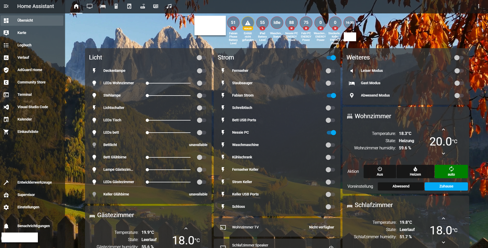

# Transparent Dark Gray

## A transparent dark gray theme for Home Assistant 
> This is my first ever custom theme for Home Assistant and my first ever GitHub/HACS repository.  
Thanks to: https://github.com/JOHLC/transparentblue for his dark blue theme, where this theme is based on.

## General information
I am using [this](https://github.com/Villhellm/lovelace-animated-background) with animated backgrounds. Thats the reason that I have removed a background from this theme.   
If you want one, please have a look below under Changing the background image. Maybe I will release a darkgray version with a background implemented.
As I am using this for my personal interest. Be aware, that I will only be giving limited support and wont accept all pull requests.

### Screenshots
**Main** 

## HACS installation - recommended  
1. Open HACS
2. Click the tree dots in the upper right
3. Click custom repositories
4. Add the URL of this github repo.
5. Go to frontend
6. Search for transparent dark gray
7. Click Install 
You should now be able to select "transparentgray-LAB" in Home Assistant. Maybe a restart of HA is required.  
"LAB" stands for "Lovelace Animated Background".

### Manual Installation - not recommended  
1. Download the transparentgray*.yaml file from this github repo.
2. Upload the downloaded file to your "themes" directory
3. Add the resource reference to your lovelace config

You should now be able to select this theme in Home Assistant
 

#### Changing the background image 
Have a look [here](https://github.com/JOHLC/transparentblue#changing-the-background-image)   
